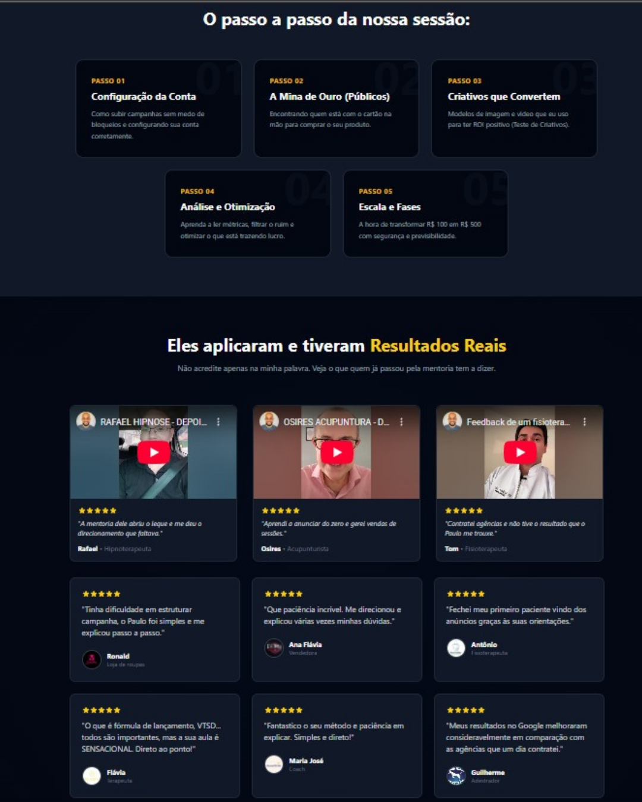
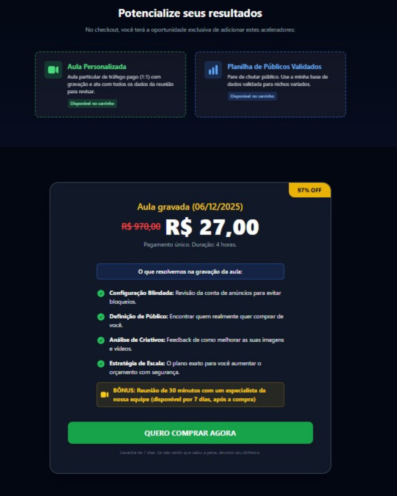

# Plataforma de Vendas High-Performance | Next.js & Analytics

> Repositório oficial da aplicação web [Sintonia Solutions](https://sintoniasolutions.com.br).

Este projeto não é apenas um portfólio, é uma **solução de engenharia focada em conversão**. Desenvolvido para unir a performance do **Next.js (App Router)** com a inteligência de dados de ferramentas de tráfego pago.

O objetivo principal foi criar uma arquitetura que suporte campanhas de alta intensidade (Google Ads/Meta Ads) sem comprometer os **Core Web Vitals**.

## 🚀 Diferenciais Técnicos

- **Next.js 16 (App Router):** Utilização de *Server Components* para reduzir o bundle enviado ao cliente e melhorar o TBT (Total Blocking Time).
- **Integração de APIs de Conversão:** Implementação *server-side* e *client-side* de eventos do GA4 e Meta Pixel, garantindo rastreamento mesmo com bloqueadores de anúncios.
- **Otimização de SEO Técnico:** Estrutura semântica e `Metadata API` dinâmica para indexação correta nos motores de busca.
- **Tailwind CSS:** Estilização utility-first para garantir responsividade total e baixo peso de CSS.

## 🛠️ Tech Stack

| Categoria | Tecnologias |
| :--- | :--- |
| **Core** | React.js, Next.js, TypeScript |
| **Estilo** | Tailwind CSS, Framer Motion (Animações) |
| **Analytics** | Google Analytics 4, GTM, Meta Pixel API |
| **Infra** | Vercel, Git |

## 🧠 Desafios & Soluções

### 1. Rastreamento sem Perda de Performance
O desafio era instalar múltiplos scripts de rastreamento (Ads, Analytics, Hotjar) sem "travar" o carregamento inicial da página.
**Solução:** Implementação de lazy loading para scripts de terceiros e priorização de recursos críticos, mantendo a pontuação do Lighthouse acima de 90.

### 2. Conversão via WhatsApp
Necessidade de medir quantos usuários realmente iniciam uma conversa, e não apenas clicam no botão.
**Solução:** Criação de um manipulador de eventos customizado em TypeScript que dispara o evento de conversão para o GTM antes de redirecionar o usuário, garantindo a precisão dos dados de ROAS.

## 📷 Preview do Projeto






## 📦 Como rodar localmente

``` bash
## Clone o repositório
git clone [https://github.com/seu-usuario/nome-do-repositorio.git](https://github.com/seu-usuario/nome-do-repositorio.git)

## Entre na pasta
cd nome-do-repositorio

# Instale as dependências
npm install

# Rode o servidor de desenvolvimento
npm run dev 
```

Desenvolvido por Paulo Cesar Frontend Developer & Growth Engineer [LinkedIn](https://www.linkedin.com/in/paulo-cesar-tech-mkt/) | [Portfólio](https://sintoniasolutions.com.br)
